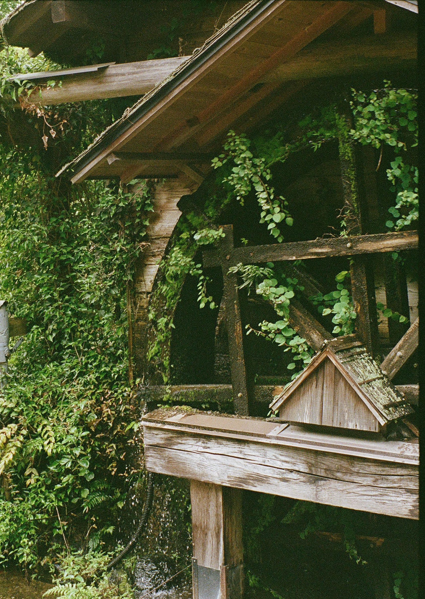
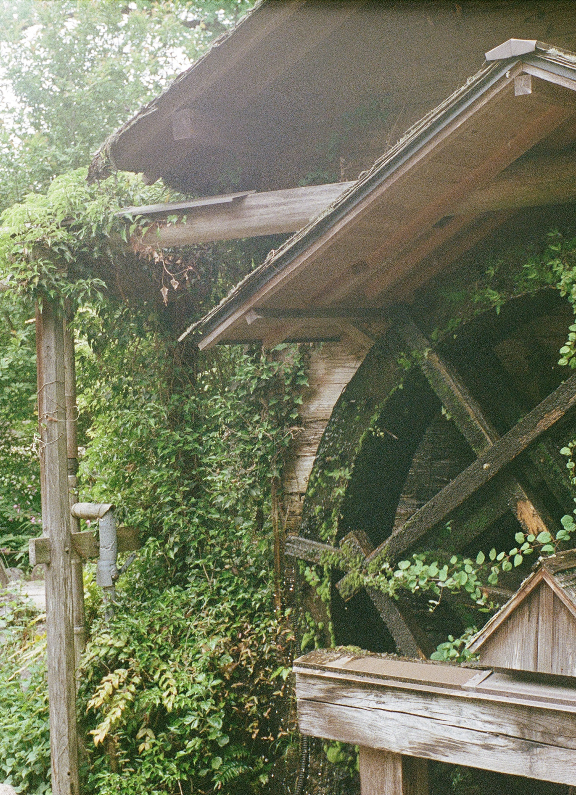
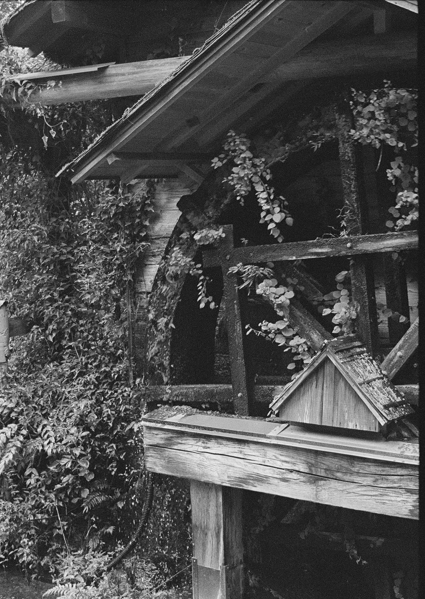

# HalfFrameUtils

A collection of tools that help with post prcessing photos with an emphasis on half frame photograohy. Features so far include:

- Splitting diptychs (2 half frame exposures on a single frame) into individual images.
- Converting images to black and white.

Limitations:
 - Currently only supports jpgs.

## Installation and Usage

### Installation

- Clone this repository

`https://github.com/jlips24/HalfFrameUtils.git`

- Navigate to the root folder of the project in your terminal
- (Optional but recomended) Create a virtual environment

`python -m venv venv`

- (If using virtual environment) Activate the virtual environment

`source venv/bin/activate`

- Install requirements

`pip install -r requirements.txt`

### Usage
The general usage for this tool is as follows:

`python HalfFrameUtils.py -hf -i ./input_folder -o ./output_folder`

#### Flags and arguements
| Argument     | Shorthand | Type   | Description                                 | Required |
|--------------|-----------|--------|---------------------------------------------|----------|
| --halfframe  | -hf       | None   | Splits half frame exposures into two images | No       |
| --blackwhite | -bw       | None   | Converts images to grayscale                | No       |
| --input      | -i        | String | Input folder path                           | Yes      |
| --output     | -o        | String | Output folder path                          | Yes      |

## Examples

###### All borders shown are for presenting the results and do not actually show up in the resulting image

### Splitting Half Frame

Original Image:

<kbd>
    
</kbd>

Command: `python HalfFrameUtils.py -i ./input -o ./output -hf`

Output Images:

<kbd>
    
</kbd>
<kbd>
    
</kbd>

### Converting to black and white

Original Image:

<kbd>
    
</kbd>

Command: `python HalfFrameUtils.py -i ./input -o ./output -bw`

Output Image:

<kbd>
    
</kbd>
